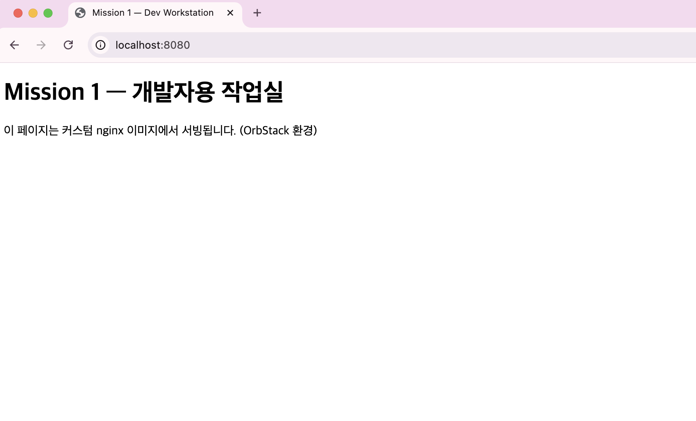
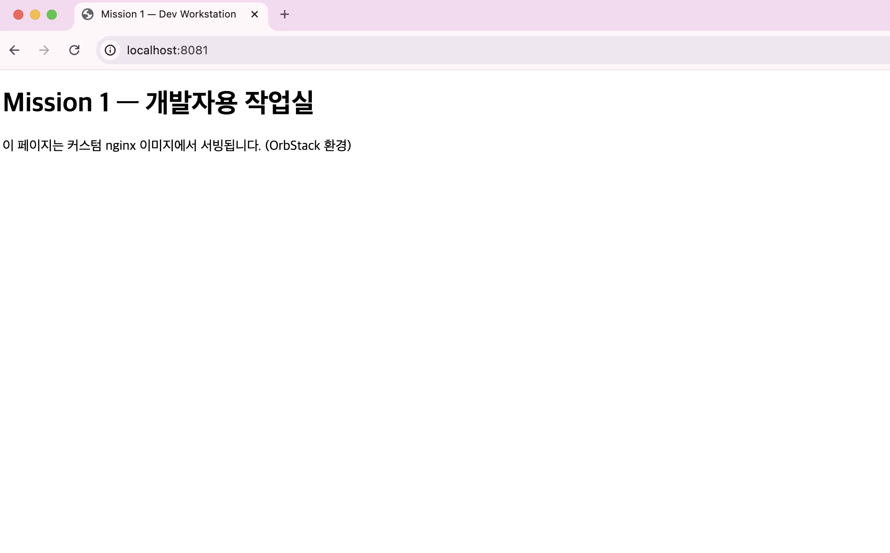
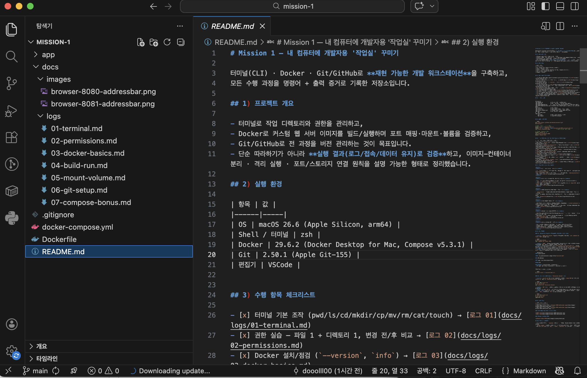

# Mission 1 — 내 컴퓨터에 개발자용 '작업실' 꾸미기

터미널(CLI) · Docker · Git/GitHub로 **재현 가능한 개발 워크스테이션**을 구축하고,
모든 수행 과정을 명령어 + 출력 증거로 기록한 저장소입니다.

## 1) 프로젝트 개요

- 터미널로 작업 디렉토리와 권한을 관리하고,
- Docker로 커스텀 웹 서버 이미지를 빌드/실행하며 포트 매핑·마운트·볼륨을 검증하고,
- Git/GitHub로 전 과정을 버전 관리하는 것이 목표입니다.
- 단순 따라하기가 아니라 **실행 결과(로그/접속/데이터 유지)로 검증**하고, 이미지-컨테이너 분리 · 격리 실행 · 포트/스토리지 연결 원칙을 설명 가능한 형태로 정리했습니다.

## 2) 실행 환경

| 항목 | 값 |
|------|-----|
| OS | macOS 15.7.7 (Apple Silicon, arm64) |
| Shell / 터미널 | zsh |
| Docker | 29.4.0, (build 9d7ad9f) |
| Git | 2.50.1 (Apple Git-155) |
| 편집기 | VSCode |


## 3) 수행 항목 체크리스트

- [x] 터미널 기본 조작 (pwd/ls/cd/mkdir/cp/mv/rm/cat/touch) → [로그 01](docs/logs/01-terminal.md)
- [x] 권한 실습 — 파일 1 + 디렉토리 1, 변경 전/후 비교 → [로그 02](docs/logs/02-permissions.md)
- [x] Docker 설치/점검 (`--version`, `info`) → [로그 03](docs/logs/03-docker-basics.md)
- [x] hello-world 실행 → [로그 03](docs/logs/03-docker-basics.md)
- [x] ubuntu 컨테이너 진입 및 내부 명령, attach/exec 차이 관찰 → [로그 03](docs/logs/03-docker-basics.md)
- [x] Dockerfile 직접 작성 → 커스텀 이미지 빌드/실행 → [Dockerfile](Dockerfile), [로그 04](docs/logs/04-build-run.md)
- [x] 포트 매핑 접속 2회 (8080, 8081) → [로그 04](docs/logs/04-build-run.md)
- [x] 바인드 마운트 변경 반영 → [로그 05](docs/logs/05-mount-volume.md)
- [x] 볼륨 영속성 (컨테이너 삭제 전/후) → [로그 05](docs/logs/05-mount-volume.md)
- [x] Git 설정 + GitHub/VSCode 연동 → [로그 06](docs/logs/06-git-setup.md)
- [x] (보너스) Compose 멀티 컨테이너 + 네트워크 통신 + 환경 변수 → [로그 07](docs/logs/07-compose-bonus.md)

## 4) 저장소 구조

```
mission-1/
├── README.md              # 본 문서 (모든 증거의 허브)
├── GUIDE.md               # 처음부터 따라할 수 있는 실습 가이드
├── GUIDE-ORBSTACK.md      # 관리자 권한 없는 Mac(OrbStack) 차이점 요약 가이드
├── GUIDE-ORBSTACK-FULL.md # OrbStack 환경 완전판 가이드 (단독으로 전 과정 수행 가능)
├── PLAN.md                # 수행 계획서
├── Dockerfile             # 직접 작성한 커스텀 이미지 정의
├── docker-compose.yml     # 보너스: web + redis 멀티 컨테이너
├── app/                   # 웹 서버 정적 콘텐츠
│   └── index.html
└── docs/
    ├── logs/              # 수행 로그 (명령어 + 출력)
    └── images/            # 접속/연동 스크린샷
```

## 5) 빠른 재현 방법

```bash
git clone https://github.com/newids/mission-1.git
cd mission-1

# 커스텀 이미지 빌드 및 실행
docker build -t mission1-web:1.0 .
docker run -d -p 8080:80 --name mission1-web-8080 mission1-web:1.0
curl http://localhost:8080            # 또는 브라우저에서 접속

# 보너스: Compose로 실행
docker compose up -d
curl http://localhost:8090
docker compose down
```

## 6) 검증 방법 요약 (무엇을 어떤 명령으로 확인했는가)

| 검증 대상 | 명령 | 확인 내용 | 증거 |
|-----------|------|-----------|------|
| 데몬 동작 | `docker info` | Server 버전/컨텍스트 응답 | [로그 03](docs/logs/03-docker-basics.md) |
| 설치 정상 | `docker run hello-world` | "Hello from Docker!" 출력 | [로그 03](docs/logs/03-docker-basics.md) |
| 컨테이너 수명 | `docker ps -a` 비교 | 메인 프로세스 종료 = 컨테이너 종료 | [로그 03](docs/logs/03-docker-basics.md) |
| 이미지 빌드 | `docker build` + `docker images` | mission1-web:1.0 생성 | [로그 04](docs/logs/04-build-run.md) |
| 포트 매핑 | `curl -w '%{http_code}'` ×2포트 | 8080/8081 모두 HTTP 200 | [로그 04](docs/logs/04-build-run.md) |
| 접속 화면 | 브라우저 | 페이지 렌더링 | [images/](docs/images/) |
| 마운트 반영 | 호스트 파일 수정 → `curl` | v1 → v2 즉시 반영 | [로그 05](docs/logs/05-mount-volume.md) |
| 볼륨 영속성 | `rm -f` 후 재연결 → `cat` | 데이터 유지 확인 | [로그 05](docs/logs/05-mount-volume.md) |
| Git 설정 | `git config --global --list` | user/defaultBranch 설정 | [로그 06](docs/logs/06-git-setup.md) |
| 컨테이너 간 통신 | `nc -zv redis 6379` | 서비스 이름으로 연결 성공 | [로그 07](docs/logs/07-compose-bonus.md) |

## 7) 학습 정리 (과제 목표 6항목)

<details>
<summary><b>절대 경로 vs 상대 경로</b></summary>

- 절대 경로는 루트(`/`)부터 시작해 현재 위치와 무관하게 항상 같은 곳을 가리킨다: `/Users/newid/codyssey/practice`
- 상대 경로는 현재 디렉토리 기준이다: `../..`(두 단계 위), `codyssey/practice`(아래로)
- 실습 증거: [로그 01 §4](docs/logs/01-terminal.md)
</details>

<details>
<summary><b>파일 권한 r/w/x와 755, 644 해석 규칙</b></summary>

- 권한은 소유자(u)/그룹(g)/기타(o) 세 자리, 각 자리는 r(4)+w(2)+x(1)의 합.
- `755` = `rwxr-xr-x`, `644` = `rw-r--r--`.
- 디렉토리의 `x`는 진입(cd), `w`는 내부 파일 생성/삭제 권한 — `chmod 500` 상태에서 `touch` 실패로 직접 확인.
- 실습 증거: [로그 02](docs/logs/02-permissions.md)
</details>

<details>
<summary><b>기존 Dockerfile 기반 커스텀 이미지</b></summary>

- `nginx:alpine` 베이스에 LABEL/ENV/COPY/HEALTHCHECK를 추가해 커스텀 이미지를 빌드했다.
- 이미지는 설계도, 컨테이너는 실행 인스턴스 — 같은 이미지로 8080/8081 두 컨테이너를 띄워 확인.
- 증거: [Dockerfile](Dockerfile), [로그 04](docs/logs/04-build-run.md)
</details>

<details>
<summary><b>포트 매핑이 필요한 이유</b></summary>

- 컨테이너는 격리된 네트워크 네임스페이스에서 동작하므로, `-p host:container`로 호스트 포트를 포워딩해야 외부에서 접속할 수 있다.
- 호스트 포트만 바꾸면 같은 서비스를 여러 개 동시 실행할 수 있다 (8080/8081 실험).
- 증거: [로그 04 §7](docs/logs/04-build-run.md)
</details>

<details>
<summary><b>Docker 볼륨 (영속 데이터)</b></summary>

- 컨테이너 쓰기 레이어는 컨테이너 삭제와 함께 사라지지만, 볼륨은 Docker 관리 영역에 독립적으로 존재한다.
- 컨테이너를 `rm -f`로 삭제한 뒤 새 컨테이너에 같은 볼륨을 연결해도 데이터(`persistent-hello`)가 유지됨을 확인.
- 증거: [로그 05 §B](docs/logs/05-mount-volume.md)
</details>

<details>
<summary><b>Git vs GitHub 역할 차이</b></summary>

- Git: 로컬에서 완결되는 분산 버전 관리 시스템 (커밋/브랜치/이력).
- GitHub: Git 저장소를 호스팅하는 원격 협업 플랫폼 (PR/이슈/CI).
- GitHub 없이도 Git은 동작하며, GitHub는 Git 기반 서비스 중 하나다.
- 정리: [로그 06 §5](docs/logs/06-git-setup.md)
</details>

## 8) 트러블슈팅

### #1. Dockerfile 명령어를 터미널에서 실행하여 발생한 오류

- **문제**: `FROM nginx:alpine` 명령어를 터미널에서 실행하여 `zsh: command not found: FROM` 오류가 발생.

```bash
$ FROM nginx:alpine
zsh: command not found: FROM
```
- **원인**: `FROM`은 터미널 명령어가 아니라 Dockerfile 내부에서 사용하는 Docker 명령어인데, 실행 위치를 혼동하여 zsh에서 실행했기 때문.
- **확인**: Dockerfile을 수정한 뒤 `docker build -t mission1-web:1.0 .` 명령을 실행하여 이미지가 정상적으로 생성되었고, 컨테이너 실행 후 `http://localhost:8080`에서 웹 페이지가 정상적으로 출력되며 Health Check 상태가 `healthy`인 것을 확인. 
- **해결**: Dockerfile 명령어는 Dockerfile 내부에 작성하고, 이미지는 `docker build` 명령으로 생성하도록 작업 절차를 수정했다.

```dockerfile
FROM nginx:alpine

LABEL org.opencontainers.image.title="mission1-web"

ENV APP_ENV=dev

COPY app/ /usr/share/nginx/html/

EXPOSE 80

HEALTHCHECK --interval=30s --timeout=3s \
  CMD wget -qO- http://localhost/ > /dev/null || exit 1
```

이후 이미지를 다시 빌드했다.

```bash
$ docker build -t mission1-web:1.0 .
```

### #2. 파일 권한 설정 오류로 `Permission denied` 발생

- **문제**: `secret.txt`의 권한을 테스트하는 과정에서 `chmod 000`을 적용한 뒤 `cat secret.txt` 실행 시 `Permission denied` 오류가 발생.

```bash
$ chmod 000 secret.txt
$ cat secret.txt
cat: secret.txt: Permission denied
```
- **원인**: `000` 권한은 읽기(r), 쓰기(w), 실행(x) 권한을 모두 제거하므로 파일에 접근할 수 없었다.
- **확인**: 권한을 `644`로 변경한 후 파일 내용을 정상적으로 읽을 수 있는 것을 확인했다.
- **해결/대안**: Linux 파일 권한을 변경하기 전에 권한의 의미를 확인하고, 일반적인 텍스트 파일은 `644`, 디렉터리는 `755` 권한을 사용하도록 했다.

```bash
$ chmod 644 secret.txt
$ cat secret.txt
important data
```

## 9) 증거 이미지

| 증거 | 파일 | 상태 |
|------|------|------|
| 8080 접속 (주소창 포함) | [browser-8080-addressbar.png](/docs/images/browser-8080-addressbar.png) | ✅ |
| 8081 접속 (주소창 포함) | [browser-8081-addressbar.png](/docs/images/browser-8081-addressbar.png) | ✅ |
| VSCode GitHub 연동 | [vscode-github.png](docs/images/vscode-github.png) | ✅ 민감정보 노출 없음 확인 |

### 포트 매핑 접속 화면 (주소창 포함)

 
 


### VSCode ↔ GitHub 연동



## 10) 보안 및 개인정보

- 문서/로그의 이메일은 `<masked>` 처리했고, 토큰·비밀번호·개인키는 어떤 로그에도 포함되지 않았다.
- `docker images` 출력에서 미션과 무관한 개인 프로젝트 이미지 목록은 필터링했다.
- 커밋 전 `git grep`으로 `ghp_`, `token`, `password` 등 민감 패턴 부재를 확인했다.
